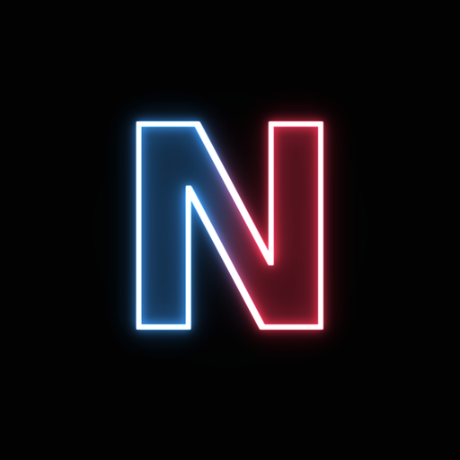

# Neonify — Procedural Neon Art Tool

<p align="center">
  
</p>

<p align="center">
  <a href="https://github.com/HAKORADev/Neonify/releases">
    
  </a>
</p>

<p align="center">
  <strong>Local &bull; Free &bull; Cross-Platform &bull; Zero AI</strong><br/>
  Turn images, videos, audio and 3D meshes into glowing neon art with pure math.
</p>

---

**Neonify** is a local, free, offline procedural art engine that transforms whatever asset you feed it into neon tube art. Edge detection finds the lines, Gaussian bloom pyramids make them glow, palette mapping gives them color — no neural networks, no model downloads, no accounts. The entire engine is deterministic math running on your machine, and it uses your CUDA GPU automatically when one is present (falling back to full CPU when it is not).

📦 **Pre-built binaries available** — no Python or setup needed. Grab the [latest release](https://github.com/HAKORADev/Neonify/releases) with CPU binaries for Windows and Linux, download, extract, and run.

---

## Quick Start

### Run from Source
```bash
# Clone the repository
git clone https://github.com/HAKORADev/Neonify.git
cd Neonify

# Install dependencies
pip install -r requirements.txt

# Launch GUI
python src/neonify.py

# Or use CLI mode
python src/neonify.py cli
```

### Installation Requirements
```bash
# Install FFmpeg (required for video and audio inputs)
# Windows: winget install FFmpeg
# macOS: brew install ffmpeg
# Linux: sudo apt install ffmpeg
```

---

## The Four Canvases

| Command | Input | Output | Engine |
|---------|-------|--------|--------|
| **neon** | Image | `_neon` image | Sobel edges → multi-octave bloom → palette mapping |
| **neon** | Video | `_neon` video | Per-frame neon engine + audio-reactive glow pulse (STFT beat envelope) |
| **audio** | Audio | `_neon.png` spectrogram art | STFT magnitude → log-frequency neon spectrum |
| **audio --anim** | Audio | `_neon.mp4` | Animated glowing spectrum bars synced to the music, original audio muxed |
| **mesh** | `.obj` / `.stl` | `_neon.png` | Wireframe extraction → perspective projection → depth-weighted glow (Fresnel-style rim) |
| **mesh --turntable** | `.obj` / `.stl` | `_neon_turntable.mp4` | Full orbit animation of the glowing wireframe |

### 🎨 **7 Neon Palettes**

| Palette | Mood |
|---------|------|
| **Electric** (default) | Deep blue → cyan → white, classic neon sign |
| **Synthwave** | Purple → pink → sunset orange |
| **Toxic** | Radioactive green → lime |
| **Ice** | Frozen blue → pure white |
| **Fire** | Ember red → orange → white heat |
| **Ghost** | Monochrome white — the dark&white signature |
| **Spectrum** | Hue mapped to edge direction — every angle gets its own color |

---

## Usage Guide

### GUI Mode

1. Launch: `python src/neonify.py`
2. Drag & drop files (images, videos, audio and meshes can be mixed)
3. Pick palette, glow and edge threshold
4. Click **NEONIFY**
5. Preview results with the before/after comparison slider
6. Open the output folder — every result lands next to its source with a `_neon` name

### CLI Mode (Interactive)
```bash
python src/neonify.py cli
```

### CLI Mode (Direct)
```bash
# Images and videos
python src/neonify.py neon photo.jpg
python src/neonify.py neon clip.mp4 --pulse on
python src/neonify.py neon art.png --palette synthwave --glow 1.6 -o out.png
python src/neonify.py neon art.png --threshold 0.06

# Audio
python src/neonify.py audio song.mp3
python src/neonify.py audio song.mp3 --anim

# 3D meshes
python src/neonify.py mesh model.obj
python src/neonify.py mesh model.stl --turntable 120 --azimuth 45

# System info
python src/neonify.py info
```

### Options

| Flag | Values | Default | Description |
|------|--------|---------|-------------|
| `--palette` | electric, synthwave, toxic, ice, fire, ghost, spectrum | electric | Neon color palette |
| `--glow` | 0.2 – 3.0 | 1.0 | Bloom intensity multiplier |
| `--threshold` | 0.02 – 0.5 | 0.12 | Edge detection sensitivity |
| `--pulse` | auto, on, off | auto | Audio-reactive glow pulse for videos |
| `--anim` | flag | off | Audio: animated spectrum video instead of PNG |
| `--turntable` | frames | 0 | Mesh: orbit video with N frames |
| `--azimuth` / `--elevation` | degrees | 30 / 20 | Mesh camera angles for single views |
| `--device` | auto, cpu, gpu | auto | Compute device (GPU falls back to CPU) |
| `-o` | path | auto | Output file or folder |

---

## How It Works

No AI anywhere — every pixel is earned with math:

- **Edges**: Sobel operators on a pre-smoothed luminance field, soft-thresholded into tube lines
- **Glow**: a cascade of wide Gaussian blurs at four octaves, additive-composited into a bloom field
- **Color**: intensity-mapped palette LUTs with a white-hot core pass for the tube centers
- **Audio**: short-time Fourier transform, log-frequency warping, percentile-robust normalization
- **Pulse**: the video's own audio track is decoded and its STFT envelope modulates the bloom octaves per frame — the glow literally breathes with the beat
- **Meshes**: OBJ/STL parsing, deduplicated edge extraction, orbit camera with perspective projection, depth-weighted line intensity for the rim-glow look

---

## System Requirements

| Component | Minimum | Recommended |
|-----------|---------|-------------|
| **CPU** | 2 cores | 4+ cores |
| **RAM** | 4GB | 8GB+ |
| **GPU** | None (CPU works) | NVIDIA GTX 1060+ (used automatically) |
| **Storage** | 1GB | SSD recommended |
| **FFmpeg** | Required for video/audio | — |

**Note:** Neonify works fully on CPU. GPU with CUDA accelerates large images and long videos automatically when PyTorch sees it.

---

## Supported Formats

### Images
`.jpg`, `.jpeg`, `.png`, `.bmp`, `.tiff`, `.tif`, `.webp`

### Videos
`.mp4`, `.avi`, `.mov`, `.mkv`, `.webm`, `.flv`, `.wmv`, `.m4v`

### Audio
`.mp3`, `.wav`, `.flac`, `.ogg`, `.m4a`, `.aac`, `.wma`, `.opus`

### Meshes
`.obj`, `.stl` (binary and ASCII)

---

## 🎬 Showcase

<p align="center">
  <i>Samples will land here — the folder is ready and waiting.</i>
</p>

---

## License

Neonify is proprietary — personal, private, non-commercial use permitted. See [LICENSE](LICENSE).

Runtime dependencies keep their own licenses (PyTorch BSD, OpenCV Apache 2.0, NumPy BSD, PyQt5 GPL).
