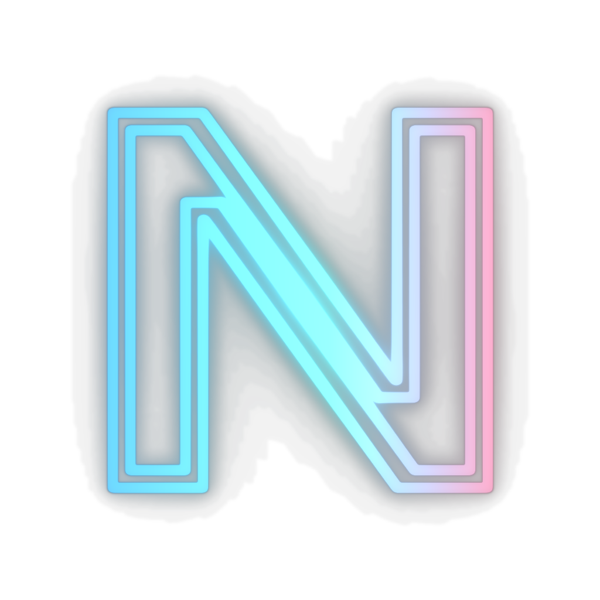

# Neonify

<p align="center">
  
</p>

<p align="center">
  <a href="https://github.com/HAKORADev/Neonify/releases">
    
  </a>
  <a href="https://github.com/HAKORADev/Neonify/blob/main/LICENSE">
    
  </a>
</p>

Neonify turns images, videos, audio and 3D meshes into neon art. It runs locally on your machine, no accounts, no uploads.

Images: edges become glowing tubes, PNG transparency follows the source art, and the original can sit under the effect three ways — wiped to black, kept with neon only on the edges, or kept under the full global glow. Videos: the same treatment per frame, with an option to run the audio through it too. Audio: seven profiles (fire, ice, robotic, ghost, void, echo, slash) that each react to the Glow setting. 3D: OBJ / PLY / STL rendered as neon wireframes, still or as a 360° turntable video, plus image-to-relief remeshing with OBJ export.

The desktop neonifier is a second binary in the same package: it captures the screen the low-level way (DXGI duplication on Windows, X11 or the desktop portal on Linux) and paints the neon effect live over your desktop or the focused window. `ctrl+alt+n` toggles it, `ctrl+alt+n` then `w` neonifies just the focused window. On first run every binary probes the machine once — graphics device, opencl, a real cpu/gpu benchmark, the video encoders ffmpeg can actually drive here — and writes `neonify.ini` next to the binary. Every value in that file carries two comment lines (what it is, what ranges are valid) and a checker repairs corrupt or extra entries back to defaults without touching the rest. Delete the file and the next run detects everything fresh.

## Download

Get a package from the [releases](https://github.com/HAKORADev/Neonify/releases), extract, run:

- `neonify.exe` — opens the GUI (Windows)
- `neonify-desktop.exe` — the desktop neonifier, tray icon + hotkeys (Windows)
- `cli.bat` — interactive CLI (Windows)
- `./neonify` — GUI (Linux), `./neonify cli` — interactive CLI
- `./neonify-desktop` — the desktop neonifier (Linux)

ffmpeg is needed for video and audio only. Install it once: `winget install FFmpeg` on Windows, `sudo apt install ffmpeg` on Linux.

The Python source under `src/python` still runs from source if you have the
dependencies, but it is frozen — the native build is the product and the only
thing the releases ship.

## The GUI

Left: input files, each with Preview and Delete. Right: results, each with Preview and Compare. Center: the preview — zoomable image viewer, video player, audio waveform player, and a 10-second 360° orbit render for 3D inputs. Bottom: settings for the files you queued, on 0–100 scales. Compare shows the result next to its original — shared zoom and pan for images, synced seek and speed for videos, position sync for audio with waveforms.

## CLI

```bash
neonify image photo.png --palette ice
neonify video clip.mp4 --neon-audio --profile ghost
neonify audio track.mp3 --profile fire
neonify mesh model.obj --turntable 240
neonify batch ./photos
neonify profiles
```

Without a command, `neonify` opens the GUI. `neonify cli` opens the interactive CLI.

## Options

| Option | Default | Description |
|--------|---------|-------------|
| `--palette` | `electric` | `electric`, `synthwave`, `toxic`, `ice`, `fire`, `ghost`, `spectrum` (rainbow edges) |
| `--glow` | `1.0` | glow intensity 0.1–3.0 |
| `--threshold` | `0.12` | edge sensitivity 0.02–0.5 |
| `--env` | `1.0` | ambient detail 0–2 |
| `-o, --output` | auto | output path |
| `--next-to-input` | off | save next to the input file instead of `results/` |
| `--keep-inside` | off | keep the original, neon only on the edges (images/videos) |
| `--global-glow` | off | keep the original under the full global glow field |
| `--profile` | `slash` | audio profile (audio mode, or video with `--neon-audio`) |
| `--neon-audio` | off | neonify the audio with the video |
| `--no-spatial` | off | disable spatial glow (stereo pan) |
| `--advanced-audio` | — | JSON overrides for profile parameters |
| `--turntable <n>` | `0` | 3d turntable frames (0 = still) |
| `--azimuth / --elevation` | `30 / 20` | 3d view angles |
| `--depth` | `0.85` | relief depth 0.1–3.0 |
| `--export-mesh` | off | relief runs also write the remeshed OBJ |
| `--json-progress` | off | progress as JSON lines (for the GUI) |

## Outputs

Default outputs land in `results/`, named `name_neonify_effect_timestamp` — `photo_neonify_ice_261003152708.png`, `track_neonify_fire_261003153228.wav`, `clip_neonify_synthwave_261003154510.mp4`. The interactive CLI also offers a custom output path as a third location. Nothing ever overwrites.

## Requirements

Any recent desktop CPU. A GPU is used for the math when the first-run probe
proves it is actually faster here, and ffmpeg can get hardware encoding when
the machine has it — the ini records what was really detected. ffmpeg for video
and audio. Windows 10+ or Linux (X11 fully supported; Wayland capture through
the desktop portal, with the overlay presented through XWayland).

## License

MIT — see [LICENSE](LICENSE).
